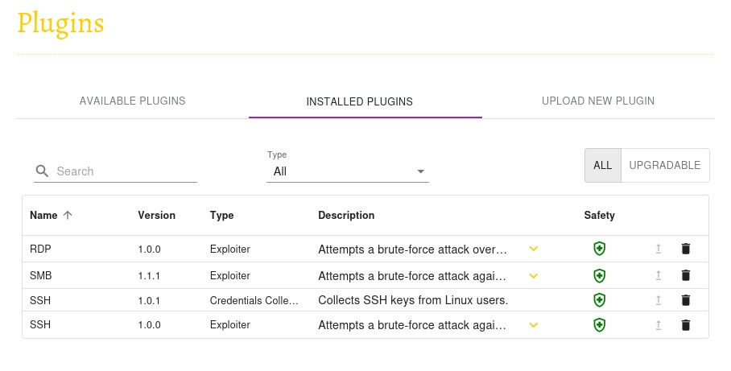
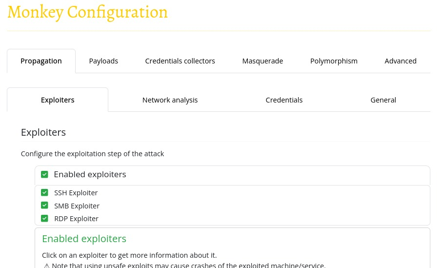
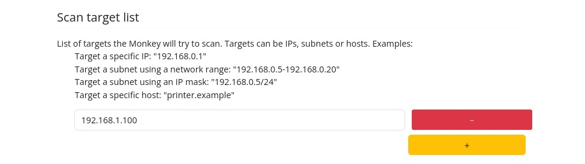
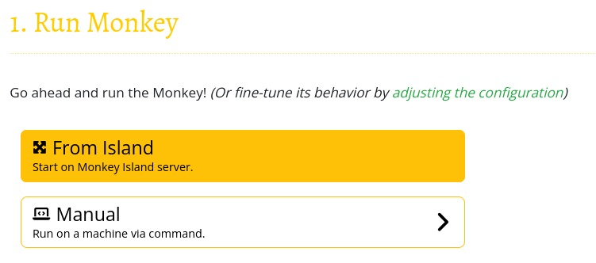
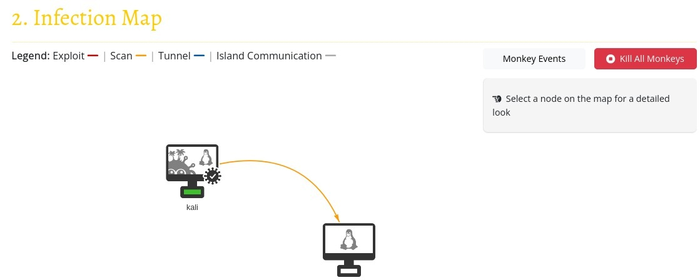

# Guía para la emulación de adversarios: Instalación, Configuración y Auditoría

Este manual describe el proceso integral para desplegar un laboratorio automatizado orientado a la simulación de amenazas en entornos virtualizados. Se emplean herramientas como **Terraform** para la orquestación de la infraestructura, **Ansible** para la automatización de la configuración de sistemas y **Chef InSpec** para la comprobación de seguridad y servicios. El objetivo es facilitar la creación de un entorno robusto para pruebas de ciberseguridad y análisis de comportamientos maliciosos.

<br>


## 1. Herramientas necesarias

Antes de iniciar, verifica que tu equipo cuente con las siguientes utilidades instaladas y correctamente configuradas:

- **Terraform**: Gestión de infraestructura como código.
- **Ansible**: Automatización de despliegue y configuración.
- **Chef InSpec**: Validación y auditoría de sistemas.
- **Vagrant**: Provisión y administración de entornos virtuales.
- **SSH** y **sshpass**: Acceso remoto automatizado a las máquinas virtuales.

> **Recomendación:** Utiliza versiones recientes de cada herramienta para evitar incompatibilidades.

<br>

## 2. Organización del repositorio

El proyecto está estructurado en carpetas y archivos que facilitan la gestión modular de cada componente:

```
.
├── ansible/
│   ├── ansible.cfg
│   ├── inventory
│   ├── playbooks/
│   │   ├── kali.yml
│   │   └── ubuntu-server.yml
│   ├── roles/
│   │   ├── infection-monkey/
│   │   │   └── main.yml
│   │   └── victim-server/
│   └── handlers/
│       └── main.yml
├── boxes/
│   ├── kali.box
│   ├── PF-SENSE.box
│   └── ubuntu2204.box
├── inspec/
│   ├── kali-infection-monkey/
│   │   ├── controls/
│   │   │   └── infection_monkey.rb
│   │   ├── inspec.lock
│   │   └── inspec.yml
│   └── ubuntu-victim-server/
│       ├── controls/
│       │   └── victim_services.rb
│       ├── inspec.lock
│       └── inspec.yml
└── terraform/
    ├── inventory.tmpl
    └── main.tf
```

Cada directorio cumple una función específica, permitiendo una gestión clara y eficiente de los recursos y configuraciones.

<br>

## 3. Aprovisionamiento de infraestructura con Terraform

Para desplegar las máquinas virtuales, sigue estos pasos:

1. Accede al directorio `terraform`:

   ```bash
   cd terraform
   ```
2. Inicializa el entorno de trabajo:

   ```bash
   terraform init
   ```
3. Revisa la planificación de recursos:

   ```bash
   terraform plan
   ```
4. Ejecuta el despliegue:

   ```bash
   terraform apply
   ```
   Confirma la operación cuando se solicite.

Terraform se encargará de crear las instancias virtuales utilizando las imágenes especificadas, asegurando la coherencia del entorno.

<br>

## 4. Automatización de la configuración con Ansible

Una vez desplegadas las máquinas, es momento de configurar los servicios y aplicaciones:

1. Verifica que el archivo `inventory` de Ansible contenga los datos de acceso (IP/hostnames) de las nuevas máquinas. Este archivo suele generarse automáticamente a partir de una plantilla tras la ejecución de Terraform.
2. Ejecuta los playbooks desde el directorio `ansible`:

   ```bash
   ansible-playbook -i inventory playbooks/kali.yml
   ansible-playbook -i inventory playbooks/ubuntu-server.yml
   ```
   

      ```bash
   ansible-playbook -i inventory playbooks/ubuntu-server.yml
   ```

   

   Estos scripts automatizan la instalación y ajuste de los servicios requeridos en cada sistema, de acuerdo a los roles definidos.

> **Tip:** Puedes modificar los roles de Ansible para personalizar la instalación según tus necesidades de laboratorio.

<br>

## 5. Auditoría y verificación con Chef InSpec

Para asegurar que la infraestructura cumple con los requisitos de seguridad y funcionalidad:

1. Entra en el directorio `inspec`.
2. Cada subcarpeta corresponde a un perfil de pruebas para una máquina específica.
3. Ejecuta las pruebas de InSpec, adaptando los parámetros de conexión:
   ```bash
   inspec exec inspec/kali-infection-monkey -t ssh://usuario@ip_kali --password 'contraseña'
   ```
   

    ```bash
   inspec exec inspec/ubuntu-victim-server -t ssh://usuario@ip_ubuntu --password 'contraseña'
   ```

   

   Así podrás validar que los servicios críticos estén correctamente instalados y configurados.

<br>

## 6. Ejecución y análisis con Infection Monkey

Para comenzar a utilizar Infection Monkey, primero asegúrate de que el servicio esté en funcionamiento. Puedes comprobar el estado del servicio ejecutando:

```bash
sudo systemctl status monkeyd
```

Una vez verificado que Infection Monkey se encuentra activo, accede a la interfaz web de administración abriendo tu navegador y dirigiéndote a:

```text
https://localhost:5000
```
Allí tendrás acceso al panel de configuración y gestión de la herramienta.

**Instalación de plugins**

Dentro del menú principal, localiza la sección Plugins. Aquí se listan los complementos adicionales que pueden potenciar las capacidades de Infection Monkey. Procede a instalar los cuatro plugins recomendados, que aparecen destacados en la interfaz (puedes consultar la imagen de referencia en la documentación del proyecto).



**Activación de plugins instalados**

Tras completar la instalación, navega a la sección de Configuración. En este apartado, asegúrate de habilitar todos los plugins recién instalados para que estén activos durante las simulaciones.



**Configuración del objetivo de escaneo**

En el área de configuración, localiza la opción para definir el objetivo del escaneo. Selecciona la dirección IP correspondiente a la máquina ubuntu-server, de modo que Infection Monkey dirija sus pruebas y simulaciones a ese sistema concreto.



**Ejecución de la simulación**

Por último, accede a la sección Run Monkey. Desde aquí, puedes iniciar el proceso de simulación de ataques. Haz clic en el botón de ejecución y supervisa el progreso de la simulación a través del panel de control.






<br>

## 7. Detección de actividades sospechosas en la red

<br>

## 8. Refuerzo y respuesta ante hallazgos
